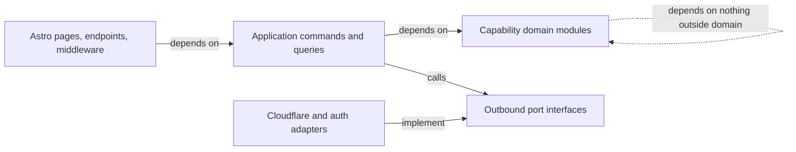
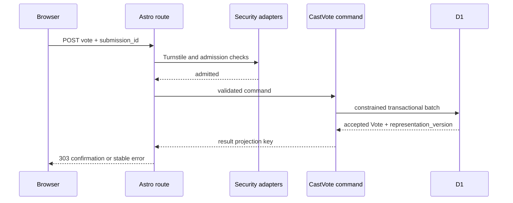
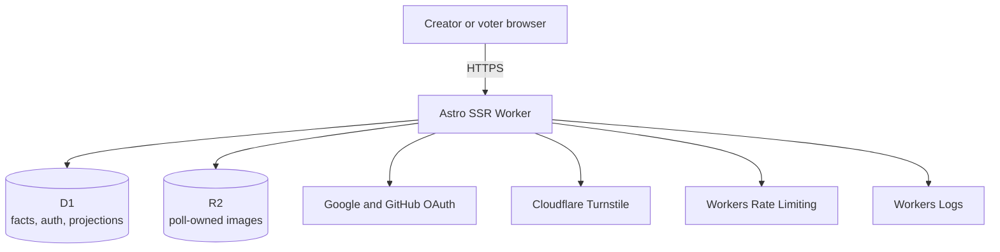
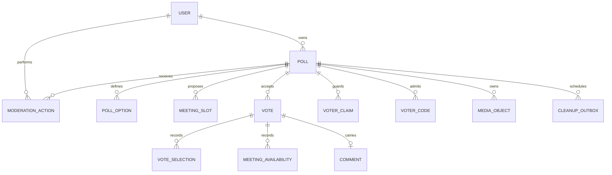
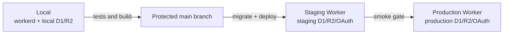

# Architecture Spine — Oddspark Polls

## Design Paradigm

**Hexagonal modular monolith.** One Astro application deploys as one Cloudflare
Worker. Capability modules own domain policy and use cases. Astro routes are
inbound adapters; D1, R2, Better Auth, Turnstile, rate limiting, and telemetry
are outbound adapters.



## Invariants & Rules

### AD-1 — Hexagonal dependency direction

- **Binds:** All capabilities and source modules
- **Prevents:** Route handlers, persistence code, and UI independently owning
  business rules
- **Rule:** Delivery adapters may call application commands and queries;
  application code may call domain code and outbound ports; domain code imports
  neither Astro nor provider APIs; provider adapters implement ports and never
  call delivery code.

### AD-2 — Server-rendered, progressively enhanced surfaces

- **Binds:** All browser surfaces and the UX performance constraint
- **Prevents:** A hydrated SPA becoming the default and client/server validation
  drifting
- **Rule:** Start from the official Cloudflare Astro Workers starter. Render
  functional HTML on the server with zero client JavaScript by default. Add
  isolated vanilla TypeScript enhancements only where the UX requires them, and
  preserve working POST-redirect-GET flows without JavaScript.

### AD-3 — Poll types are strategies behind one product contract

- **Binds:** FR-2–FR-14 and poll-type epics
- **Prevents:** A giant poll-type switch and incompatible lifecycle, security,
  or result contracts
- **Rule:** Each Poll Type implements the same `create`,
  `validateSubmission`, `persistFacts`, and `projectResults` ports. Shared
  lifecycle, ownership, discovery, security, comments, and result visibility
  wrap these strategies. Accepted ballots and availability are normalized
  relational facts, not opaque JSON payloads. `CreatePoll` validates the shared
  fields, asks exactly one Poll Type strategy for normalized creation facts, and
  commits the Poll, type facts, options or slots, slug reservation, and adopted
  media records in one D1 batch. A failed batch leaves no reachable Poll.

### AD-4 — Creator identity is separate from Poll ownership [ADOPTED]

- **Binds:** CAP-CREATOR-SELF-SERVICE, creator routes, poll mutation, exports,
  and moderation
- **Prevents:** Authentication being mistaken for authorization or one creator
  mutating another creator's polls
- **Rule:** Public self-service creation is adopted from the 2026-07-29 user
  direction. Better Auth owns creator identity and sessions in D1, initially
  with Google and GitHub OAuth. Every creator command addresses a Poll by both
  Poll ID and an internal, provider-independent creator user ID. OAuth
  `(provider, provider_account_id)` pairs map to that user and are never stored
  as Poll ownership or authorization keys. The same internal user row carries
  a server-owned `creator | administrator` role that defaults to `creator`; D1
  permits at most one Administrator. Assignment, transfer, and revocation are
  environment-specific, out-of-band operations against the internal user ID,
  with no in-product grant surface or general role system. The session role is
  an early application check, while every moderation transaction rechecks the
  live D1 role. Ownership never implies moderation authority. Voters remain
  anonymous.

### AD-5 — Discovery is independent of result visibility [ADOPTED]

- **Binds:** CAP-DISCOVER, CAP-SHARE, FR-20, and FR-23
- **Prevents:** Tally visibility, link reachability, and public-directory
  eligibility being conflated
- **Rule:** Public Poll discovery is adopted from the 2026-07-29 user direction.
  Persist `result_visibility` separately from `discovery_state`.
  Every new Poll starts `unlisted`; creation presents an explicit opt-in to
  `listed`. Unlisted Polls remain reachable by link but are absent from discovery and
  sitemaps. Discovery owns the `unlisted`, `listed`, and `delisted` state
  machine. A Poll owner may move between `unlisted` and `listed`; an
  administrator may move any Poll to `delisted`, which only an administrator
  may clear. Delisting captures the Creator's immediately preceding
  `listed | unlisted` choice; clearing restores it. A legacy Delisted Poll
  without usable action history clears to privacy-safe `unlisted`. Repeated
  delist is an idempotent no-op, while clear against a non-Delisted Poll is an
  invalid transition. The public directory and sitemap return only eligible
  literal `listed` Polls. Delisting changes neither link reachability,
  ownership, result visibility, Poll representation, nor Vote data.

### AD-6 — D1 owns facts; everything else is a projection

- **Binds:** All Poll, Vote, identity, Comment, Voter Code, and moderation data
- **Prevents:** D1, R2, caches, or a live transport becoming competing sources
  of truth
- **Rule:** D1 is the sole transactional source of truth. R2 stores only
  Poll-owned image bytes. Tallies, Ballot Manifests, discovery cards, exports,
  and live messages are projections. In the ordinary lifecycle, accepted Vote
  facts remain immutable while their Poll aggregate exists; Meeting Poll
  availability is the one in-aggregate exception, because its session-scoped
  identity may update its own row. `ResetDemoPoll` is the one sanctioned
  aggregate-lifecycle exception: it may atomically replace only the explicitly
  configured Demo Poll under its stable canonical reference, transfer stable
  option IDs, and delete the old aggregate so its Poll-owned Voting facts
  cascade. It must refuse whenever any current or historical Discovery
  moderation fact exists. Each actual delist or clear appends one private `moderation_action`,
  ordered by a monotonic D1 sequence, and changes `discovery_state` in the same
  D1 batch. The batch includes the live Administrator-role predicate and rolls
  back action and state together on any failed statement. No-op, denied, and
  failed commands append nothing.

### AD-7 — One constrained transaction accepts a Vote

- **Binds:** Every vote path, FR-16–FR-18, concurrency safety, and retry safety
- **Prevents:** Races, browser retries, partial Voter Code redemption, and
  partially stored ballots
- **Rule:** Normalize the payload and check `submission_id` first: an exact
  committed replay returns its stored outcome without revalidating a consumed
  challenge token. For a new submission, validate external challenges before
  mutation, then commit the Vote, type-specific facts, optional typed Comment
  contribution, duplicate claims, conditional Voter Code redemption, and
  incremented `representation_version` in one D1 `batch()` guarded by unique or
  conditional SQL constraints. `vote_comment` is a one-to-zero-or-one child of
  `vote`: its unique foreign key cascades on Vote deletion, so no standalone,
  duplicate, or orphan Comment can commit. A `BEFORE INSERT` guard rechecks
  `poll.comments_enabled` inside the Vote batch so a concurrent Creator disable
  rolls back the Vote and Comment together. A D1 trigger on Vote insertion
  aborts unless the referenced Poll is still effectively open at transaction
  time; foreign keys make a concurrent delete abort the Vote. Every form carries
  a unique `submission_id` independent of Security Toggles. Store the normalized
  payload hash and accepted outcome under unique `(poll_id, submission_id)`;
  the no-Comment serialization remains byte-for-byte compatible with the legacy
  payload, while a canonical Comment and display name extend new payload hashes.
  An exact replay returns its outcome, while a reused ID with a different
  ballot, Comment, or display name returns `IDEMPOTENCY_CONFLICT`. Model code use as an insert into
  `voter_code_redemptions` keyed uniquely by `code_id` with foreign keys to the
  code and Vote, so an invalid or already redeemed code aborts the entire batch
  rather than succeeding with a zero-row update.



### AD-8 — Duplicate identities are secret-keyed digests

- **Binds:** IP Checks, Session Checks, abuse keys, logs, and voter privacy
- **Prevents:** Raw network or browser identifiers leaking through D1, exports,
  logs, or creator surfaces
- **Rule:** Normalize IPv4 and IPv6 as the PRD specifies, then persist only a
  secret-keyed HMAC digest scoped to Poll and check kind. Treat the random
  first-party browser token the same way. Keep HMAC keys in Worker secrets.
  Never expose digests in projections or telemetry.

### AD-9 — Raw Votes determine every Tally

- **Binds:** FR-9, FR-10, FR-20–FR-22, and all result views
- **Prevents:** Client-authored tallies, stale aggregates, and
  non-reproducible ranked-choice outcomes
- **Rule:** Compute Tallies server-side from accepted raw Vote facts.
  Multiple-choice and Meeting Polls use SQL projections. Ranked Choice uses one
  pure deterministic tabulator shared by the live view, closed result, export,
  and tests. A closed Ballot Manifest exposes only canonically ordered,
  anonymized rankings.

### AD-10 — Live results use versioned conditional polling

- **Binds:** FR-21 and the signature live-results experience
- **Prevents:** Premature paid real-time infrastructure and incompatible refresh
  behavior across result screens
- **Rule:** Phase 1 conditionally polls one versioned result projection only
  while the page is visible on a three-second cadence, refreshes immediately
  when visibility or network connectivity returns, coalesces intermediate
  versions, and stops on close. The first failed refresh shows a non-blocking
  `RECONNECTING` state while preserving the last known Tally, then retries with
  capped backoff up to 30 seconds; stale results are never presented as live.
  A successful Vote increments the Poll's `representation_version` in AD-7's
  transaction.

### AD-11 — Deadlines close Polls without scheduler correctness

- **Binds:** FR-4 and every read or command that depends on Poll state
- **Prevents:** A late or failed cron allowing Votes after the Deadline
- **Rule:** Effective state is closed whenever `closed_at` is set or `deadline`
  is not later than the request timestamp. Every read and command enforces
  effective state. Scheduled maintenance may materialize closure but is not a
  correctness boundary.

### AD-12 — R2 changes use adoption and an outbox

- **Binds:** FR-5, FR-11, Image Poll creation, and Poll deletion
- **Prevents:** Assuming a D1 rollback can include R2 and accumulating orphaned
  image objects
- **Rule:** Upload to Poll-scoped temporary R2 keys and expose an image only
  after D1 adopts it. Every adopted media record singly owns an immutable R2
  key. Replacing media updates the D1 reference and enqueues the superseded key
  for cleanup in the same batch. Deletion records self-contained R2 cleanup
  keys in an outbox row with no Poll foreign key, then hard-deletes the Poll plus
  all D1-owned children in one batch, so its link immediately returns not found.
  A same-Worker `scheduled()` handler drains due outbox rows every 15 minutes;
  request handlers may also invoke the same idempotent drain with `waitUntil`
  for low-latency cleanup, but the Cron Trigger owns retries. The scheduled
  sweeper also deletes unadopted temporary keys older than 24 hours.

### AD-13 — One canonical, collision-safe Poll reference

- **Binds:** FR-3, CAP-SHARE, public routing, discovery, and moderation lookup
- **Prevents:** Reserved-route collisions, mutable share links, and guessable
  generated references
- **Rule:** Canonical Poll references occupy the root path to preserve the PRD
  contract. Routing and slug validation import one reserved-slug registry.
  Generated references contain at least 96 random bits encoded URL-safely.
  Canonical URLs do not change when display text changes. Every public voting,
  create-confirmation, and result view renders an explicit Share action and the
  canonical URL; progressive enhancement uses the Web Share API when available
  and a copy-link fallback otherwise. Administrator moderation lives at the
  one fixed `/creator/moderation` route and resolves one canonical or alias
  reference at a time; it neither enumerates Polls nor creates `/admin` or a
  new root reservation.

### AD-14 — Environments share code, never state

- **Binds:** Deployment, schema evolution, bindings, OAuth, and secrets
- **Prevents:** Local, preview, or staging traffic reaching production state and
  code/schema skew during rollout
- **Rule:** Local, staging, and production use distinct Worker names, D1
  databases, R2 buckets, auth credentials, and secrets. `wrangler.jsonc` is
  binding truth and enables the `nodejs_compat` compatibility flag required by
  the adopted Astro and assumed Better Auth runtime. Migrations are forward-only numbered SQL and use
  expand-contract compatibility before destructive cleanup. Production deploys
  only after tests, build, staging migration, and staging smoke checks pass.

### AD-15 — Telemetry is useful and voter-blind

- **Binds:** Operations, incident diagnosis, privacy, and recovery
- **Prevents:** Untraceable failures, private Vote data in logs, and recovery
  depending on application code
- **Rule:** Workers Logs record structured request ID, operation, stable result
  or error code, duration, and provider outcome. They never record tokens, voter
  digests, Comment bodies, display names, ballot content, or Voter Codes. D1 Time Travel is the
  database recovery floor—7 days on Workers Free or 30 days on Workers Paid.
  After a restore, reconcile R2 from D1 ownership records. Moderation emits
  exactly one fixed, method-qualified `GET /creator/moderation`,
  `POST /creator/moderation`, or `POST /creator/comments/delete` operation.
  Comment text, display names, Comment IDs, and submitted references remain
  forbidden even on that mutation. Explicit request-context flags classify
  central-boundary `csrf_rejected` separately from capability
  `authorization_denied`; an unflagged 403 is neither. After authorized lookup,
  telemetry may correlate the internal Poll ID, but never logs a submitted
  URL/reference/alias, question, owner ID, email, provider identity, or private
  moderation history.

### AD-16 — Admission controls have explicit failure semantics

- **Binds:** Auth, Poll creation, Vote submission, discovery, and the abuse floor
- **Prevents:** Permissive edge counters being treated as exact duplicate-vote
  protection
- **Rule:** Cloudflare Rate Limiting bindings are permissive, best-effort
  throttles keyed by authenticated user, session digest, Poll, and operation.
  When a Poll enables CAPTCHA, the server must validate Turnstile before AD-7
  and fail closed on missing, invalid, duplicate, expired, or unverifiable
  tokens. Only AD-7's D1 constraints decide duplicate claims and Voter Code
  redemption.

### AD-17 — Accepted Votes only tighten Poll lifecycle

- **Binds:** FR-2, FR-5, FR-15, and FR-24
- **Prevents:** Independently built creator, voting, and comment flows changing
  what earlier Voters agreed to
- **Rule:** A created Poll is immediately open; there is no draft state. After
  the first accepted Vote, question, options, and Poll Type are immutable,
  while description remains editable. Security Toggles may be enabled but not
  disabled. Before that first Vote, the Creator may opt the Poll into Comments
  through the same definition-edit boundary. A Comment is trimmed plain text of
  at most 500 UTF-16 code units, with an optional trimmed display name of at
  most 80; a blank Comment discards any name. It belongs to exactly one Vote,
  is accepted in AD-7's transaction under the same Security Toggles, follows
  result visibility, and may be deleted only by the Poll owner or an
  administrator.

### AD-18 — The monthly infrastructure ceiling binds topology

- **Binds:** All provider, transport, storage, telemetry, and authentication
  choices
- **Prevents:** An epic adding a convenient managed service that makes the
  product cost more than USD 5 per month before usage warrants it
- **Rule:** The production baseline must operate on Cloudflare free tiers or one
  Workers Paid plan with total fixed platform cost no greater than USD 5 per
  month. Any dependency with an additional mandatory monthly fee requires a new
  architecture decision and an explicit cost-ceiling change.

### AD-19 — Every fact has one owner and one legal write path

- **Binds:** All capability modules and D1 tables
- **Prevents:** Two epics mutating the same entity through incompatible rules
- **Rule:** Identity owns users and sessions; Polls owns Poll lifecycle,
  configuration, options, and deadlines; Discovery owns listing and moderation
  state; Voting owns Votes, selections, availability, duplicate claims, Voter
  Code redemption, and persisted Comments; Media owns media records and cleanup
  tasks. Results owns no facts. Only Discovery's `delist` and `clear_delisted`
  commands may append moderation actions or write the Administrator-owned
  `delisted` hold; owner listing commands remain confined to
  `unlisted | listed`. The Discovery D1 adapter commits the guarded role check,
  ordered action, state change, and catalog-revision trigger as one transaction.
  Only the owning module's application commands may write its tables. `CastVote`
  is the ordinary cross-module transaction coordinator. The provider-free
  `modules/comments` capability canonicalizes Comment/display-name input and
  returns a typed `vote_comment` contribution; only the D1 voting adapter maps
  that contribution into storage alongside normalized contributions returned
  by Poll Type and Security policy ports. The same capability owns the only
  legal `DeleteCommentAsOwner` and `DeleteCommentAsAdministrator` commands.
  Their D1 adapter rechecks Poll ownership or the live Administrator role in
  the atomic batch that deletes only `vote_comment` and increments the Poll's
  representation version exactly once; denials, stale targets, and failures
  change neither.
  `ResetDemoPoll` is the only additional cross-capability coordinator. The
  provider-free `polls/demo-poll` policy owns designation, fixed-template
  validation, and reset eligibility; the D1 Demo replacement adapter owns the
  purpose-shaped batch; landing and creator Poll detail routes only map HTTP
  effects. The coordinator may replace Polls-owned identity/options and thereby
  destroy Poll-owned Voting facts only for the configured Demo and only with no
  moderation history. It never writes Discovery state or moderation facts.

### AD-20 — Meeting response creation and revision are different commands

- **Binds:** FR-13, FR-15–FR-18, Voter Codes, and Meeting Poll Tallies
- **Prevents:** A legitimate availability revision failing as a duplicate Vote
  or consuming a Voter Code twice
- **Rule:** `CreateMeetingResponse` creates one Vote, establishes duplicate
  claims, and redeems any Voter Code under AD-7. It returns a random,
  first-party revision capability whose digest is stored with that Vote.
  `ReviseMeetingResponse` requires that capability, replaces only that Vote's
  availability rows, increments `representation_version`, and neither creates
  claims nor redeems a code again. D1 triggers on availability replacement
  enforce effective-open state inside the transaction, and foreign keys make a
  concurrent Poll or Vote delete abort the revision. Both commands pass
  best-effort admission throttles.

### AD-21 — Result authorization precedes projection and caching

- **Binds:** FR-20, FR-21, Comments, Ballot Manifests, exports, and discovery
- **Prevents:** Creator-only or after-close data leaking through a projection,
  ETag, cache key, or shared response
- **Rule:** Every result, Comment, Manifest, and export query accepts a
  `ViewerContext`, authorizes visibility before reading private facts, and then
  builds the permitted projection. Result and Manifest responses are never
  stored in shared caches; creator-only and not-yet-visible responses use
  `private, no-store`. Discovery cards use a separate cache namespace and an
  explicit public allowlist: question, Poll Type, canonical voting reference,
  Deadline, effectively-open status, and aggregate accepted-Vote attendance.
  That attendance count is not Tally authorization; option/round counts,
  percentages, selections, result visibility, Comments, owner identity, and
  internal Poll IDs never enter the public projection or cache.
  A visible Results read projects its Tally, complete newest-first public
  Comment list, and representation version from one D1 snapshot. Only the Poll
  owner receives the aligned moderation projection with Comment IDs. The
  Administrator's exact-reference operator query is a separate live-role-
  guarded purpose projection containing Comments but no Tally, Vote, owner, or
  security facts; it is not a Results visibility entitlement or enumeration.

### AD-22 — Every browser mutation crosses one CSRF boundary

- **Binds:** Auth, creator/admin commands, voting, comments, discovery, and media
  mutations
- **Prevents:** A third-party origin causing an authenticated creator or
  anonymous browser session to mutate state
- **Rule:** One delivery middleware rejects state-changing requests whose
  `Origin` and Fetch Metadata are not same-origin. Authenticated creator and
  administrator forms additionally require a session-bound CSRF token.
  Better Auth's mounted auth handler retains its own CSRF and OAuth state
  protections. The ordered chain is request context → telemetry wrapper →
  session extraction → CSRF boundary → creator-surface guard, so every outcome
  receives one request ID and one completion record. No capability route may
  bypass the central middleware.

### AD-23 — The Shared Kernel owns cross-capability contracts

- **Binds:** All modules, persistence adapters, and public/internal serialized
  shapes
- **Prevents:** Poll Type, Voting, Results, and Discovery epics defining
  incompatible IDs, enums, or contribution payloads
- **Rule:** `shared/domain` exclusively owns branded entity IDs and the
  `PollType`, `ResultVisibility`, `DiscoveryState`, and effective `PollStatus`
  enums. `shared/application` owns versioned Poll Type contribution interfaces
  and HTTP error envelopes. A capability owns its outward projection schema,
  while adapters must map to it rather than publish database rows. Contract
  changes require compile-time consumers and contract tests to change together.

### AD-24 — One version identifies every visible Poll representation

- **Binds:** Live Tallies, Comments, Manifests, status, result visibility, and
  conditional HTTP validation
- **Prevents:** A successful ETag revalidation hiding a non-Vote change
- **Rule:** Each Poll has one monotonically increasing
  `representation_version`. Increment it in the same transaction as any change
  that can alter a public or authorized Poll representation, including Vote
  acceptance, Meeting revision, Comment moderation, manual close, result
  visibility, and pre-Vote option or type edits. The response validator combines
  that version with effective open/closed state so crossing a Deadline
  invalidates a cached representation without a scheduled write. Listing and
  moderation state are deliberately excluded because they do not alter the
  linked Voter or authorized Results representation. An actual
  `discovery_state` transition instead increments the separate
  `discovery_catalog_revision` in the same D1 transaction; a no-op, denial, or
  failure increments neither version.
  `ResetDemoPoll` transfers the configured Demo to a successor whose version is
  the transaction-current version plus one. The D1 batch stages guarded
  successor insertion, stable option-ID transfer, stable-reference transfer,
  and old-aggregate deletion, then uses a conditional duplicate-reference
  assertion to roll back every partial shape. An actual replacement issues a
  one-shot, session-bound `demo-reset-flash` tied to successor ID and reset
  version. Vote/reset and Delist/reset races linearize at the batch: a prior Vote
  contributes its increment before reset; a losing Vote refreshes against the
  stable reference; Delist-first refuses reset; reset-first makes a stale
  moderation target retry. No migration is required because the existing
  Poll-owned cascades and stable option identities are sufficient.

## Consistency Conventions

| Concern | Convention |
| --- | --- |
| Domain names | `Poll`, `Vote`, `Ballot`, `Tally`, `Comment`, and `VoterCode` are singular PascalCase types; commands are imperative verbs; events are past-tense facts. |
| Code and SQL | TypeScript files use kebab-case; exported types use PascalCase; functions use camelCase; D1 tables and columns use snake_case; migration files use `NNNN_description.sql`. |
| Identifiers | Internal entities use UUID strings. Public Poll references use custom slugs or generated 96-bit-or-stronger base64url values. `submission_id` is unique per Poll. |
| Time | Persist UTC Unix milliseconds in D1. Exchange RFC 3339 strings. Carry an IANA timezone only when civil-time meaning matters, especially Meeting Poll creation. |
| Validation | Zod schemas validate delivery boundaries. Domain constructors enforce invariants again without importing delivery code. Provider payloads are mapped before entering application code. |
| Errors | Application errors are stable codes with safe messages and optional field errors. HTTP adapters map them once. Unknown errors return a request ID and never provider or SQL detail. |
| Mutation | Browser code never calls D1, R2, or auth storage directly. Every mutation enters one application command. Queries cannot mutate state. |
| HTML and text | Astro escaping remains on by default. Voter-supplied rich HTML is unsupported. Comments and display names are plain text. |
| HTTP | Successful mutating forms use POST then `303`. Validation failures re-render the same route with status `422`, safe submitted values, and field errors. Live results use ETag/version revalidation. Result and Manifest responses are non-cacheable by shared caches; discovery projections may use bounded public caching. |
| Configuration | Bindings, `nodejs_compat`, and non-secret flags live in `wrangler.jsonc`; secrets use Worker secrets; generated binding types are refreshed in CI; no environment lookup occurs inside domain modules. |
| Logging | Emit one structured completion record per operation. Use request ID and internal Poll ID for correlation; omit private voter and ballot fields. |
| Authorization | Authentication populates a session principal; application commands enforce resource ownership or explicit admin capability. Route hiding is never authorization. |

## Stack

Seed verified on 2026-07-29. The lockfile owns exact transitive versions after
scaffolding.

| Name | Version |
| --- | --- |
| Node.js LTS | 24.18.0 |
| pnpm | 11.17.0 |
| TypeScript | 7.0.2 |
| Astro | 7.1.5 |
| `@astrojs/cloudflare` | 14.1.6 |
| Better Auth | 1.6.25 |
| Zod | 4.4.3 |
| Wrangler | 4.115.0 |
| Vitest | 4.1.10 |
| `@cloudflare/vitest-pool-workers` | 0.19.0 |
| Playwright | 1.62.0 |
| fast-check | 4.9.0 |
| Cloudflare Workers runtime | compatibility date 2026-07-29 |
| Cloudflare D1, R2, Turnstile, Rate Limiting, Workers Logs | managed services |

## Structural Seed

```text
src/
  pages/                 # Astro inbound HTTP adapters and server-rendered pages
  middleware.ts          # request context → telemetry → session → CSRF → creator guard
  components/            # server-rendered UI bound to DESIGN.md
  scripts/               # isolated progressive-enhancement TypeScript
  lib/                   # delivery composition and cross-route helpers
  layouts/               # shared HTML document shells
  styles/                # token expression, fonts, and global presentation
  modules/
    identity/            # creator principal and authorization policy
    polls/               # lifecycle, Demo designation/reset policy, poll types
    voting/              # security composition and CastVote
    results/             # Tally and Manifest projections
    discovery/           # listed-poll eligibility and catalog queries
    comments/            # provider-free Comment normalization and typed Vote contribution
  shared/
    domain/              # provider-free value types and errors
    application/         # command/query primitives and outbound ports
  adapters/
    auth/                # Better Auth and OAuth
    cache/               # isolated public Discovery projections
    d1/                  # repositories, batches, projection SQL
      demo-poll.ts       # purpose-shaped Demo aggregate replacement batch
    digest/              # secret-keyed duplicate and admission identities
    r2/                  # temporary/adopted image objects
    turnstile/           # challenge verification
    rate-limit/          # best-effort admission controls
    telemetry/           # Workers Logs mapping
db/
  migrations/            # forward-only numbered D1 SQL
tests/
  unit/                  # pure domain and tabulation tests
  integration/           # workerd plus local D1/R2 adapter contracts
  e2e/                   # Playwright user journeys
```





| Fact set | Owning module | Only legal mutation path |
| --- | --- | --- |
| Users, accounts, sessions, Administrator role | Identity | Better Auth adapter plus guarded out-of-band role assignment |
| Poll lifecycle, type, options, Deadline, result visibility | Polls | Poll commands |
| Designated Demo aggregate replacement | Polls + Voting coordination | `ResetDemoPoll` through the D1 Demo replacement adapter; no Discovery fact may exist |
| Listing state and ordered moderation actions | Discovery | Owner listing commands or guarded `delist` / `clear_delisted` transaction |
| Votes, selections, availability, claims, code redemptions, Comments | Voting | `CastVote` maps typed `modules/comments` contributions into the Vote-owned `vote_comment` row; later moderation commands may delete Comments |
| Media records and cleanup outbox | Media | Media adoption and deletion commands |
| Tallies, Manifests, exports | Results | Read-only projections; no mutation path |



## Capability → Architecture Map

| Capability / Area | Lives in | Governed by |
| --- | --- | --- |
| FR-1, CAP-CREATOR-SELF-SERVICE | `identity`, `pages/api/auth`, `/sign-in`, creator middleware | AD-1, AD-4, AD-14 |
| FR-2–FR-5, FR-28, CAP-SHARE | `polls`, D1 Poll repository, public routes and Share action | AD-3, AD-6, AD-11, AD-13, AD-17 |
| FR-23, CAP-DISCOVER | `discovery`, catalog projection, `/discover`, `/creator/moderation` | AD-4, AD-5, AD-6, AD-13, AD-15, AD-16, AD-19, AD-22, AD-24 |
| FR-6–FR-7 | `polls/types/multiple-choice`, `voting` | AD-3, AD-7, AD-9 |
| FR-8–FR-10 | `polls/types/ranked-choice`, `results/tabulate-irv` | AD-3, AD-9 |
| FR-11 | `polls/types/image`, R2 media adapter | AD-3, AD-12 |
| FR-12–FR-14 | `polls/types/meeting`, Meeting availability repository | AD-3, AD-6, AD-9, AD-20 |
| FR-15–FR-19 | `voting/security`, D1 claims/codes, provider adapters | AD-7, AD-8, AD-16, AD-22 |
| FR-20–FR-22 | `results`, export adapters, result endpoints | AD-6, AD-9, AD-10, AD-21 |
| FR-24 | `modules/comments`, `voting` / `CastVote`, D1 `vote_comment`, creator definition and voter delivery surfaces | AD-6, AD-7, AD-15, AD-17, AD-19, AD-21, AD-22, AD-24 |
| FR-25–FR-27 | Astro landing/demo pages, shared presentation-only public-repository entry, public repository | AD-1, AD-2, AD-10, AD-14 |
| FR-26, CAP-DEMO-POLL | `polls/demo-poll` owns designation; `ResetDemoPoll`; D1 Demo replacement adapter; landing and creator Poll detail routes | AD-1, AD-6, AD-7, AD-14, AD-19, AD-22, AD-24 |
| UX live motion and trust surfaces | server result projection plus `scripts/results-live.ts` | AD-2, AD-8, AD-10 |

## Deferred

| Decision | Revisit when |
| --- | --- |
| Creator account deletion | Before public launch; account erasure and its effect on owned Polls and their Vote data needs an explicit product decision — neither the PRD nor this spine specifies it. |
| Durable Object WebSockets | Conditional polling cannot meet the desired update latency inside the monthly cost ceiling, or measured request volume makes fan-out cheaper. |
| D1 read replication | Global result or discovery reads show unacceptable latency; adopt the Sessions API with bookmark propagation if enabled. |
| Discovery ranking and search | The listed catalog is large enough that newest-first pagination is no longer useful. |
| Email, passkeys, or additional OAuth providers | Creator research shows Google and GitHub exclude a material part of the target audience. |
| Voter Codes and VPN Blocking implementation | The first real Poll needs them, per the PRD phase gate. |
| XLSX writer selection | The export epic; it must implement the export port and run inside workerd without changing domain or persistence rules. |
| Separate Workers or service bindings | A capability needs an independent deployment cadence or the modular monolith breaches a measured platform limit. |
| Analytics vendor | Success metrics require durable product analytics beyond privacy-safe Workers operational telemetry. |
